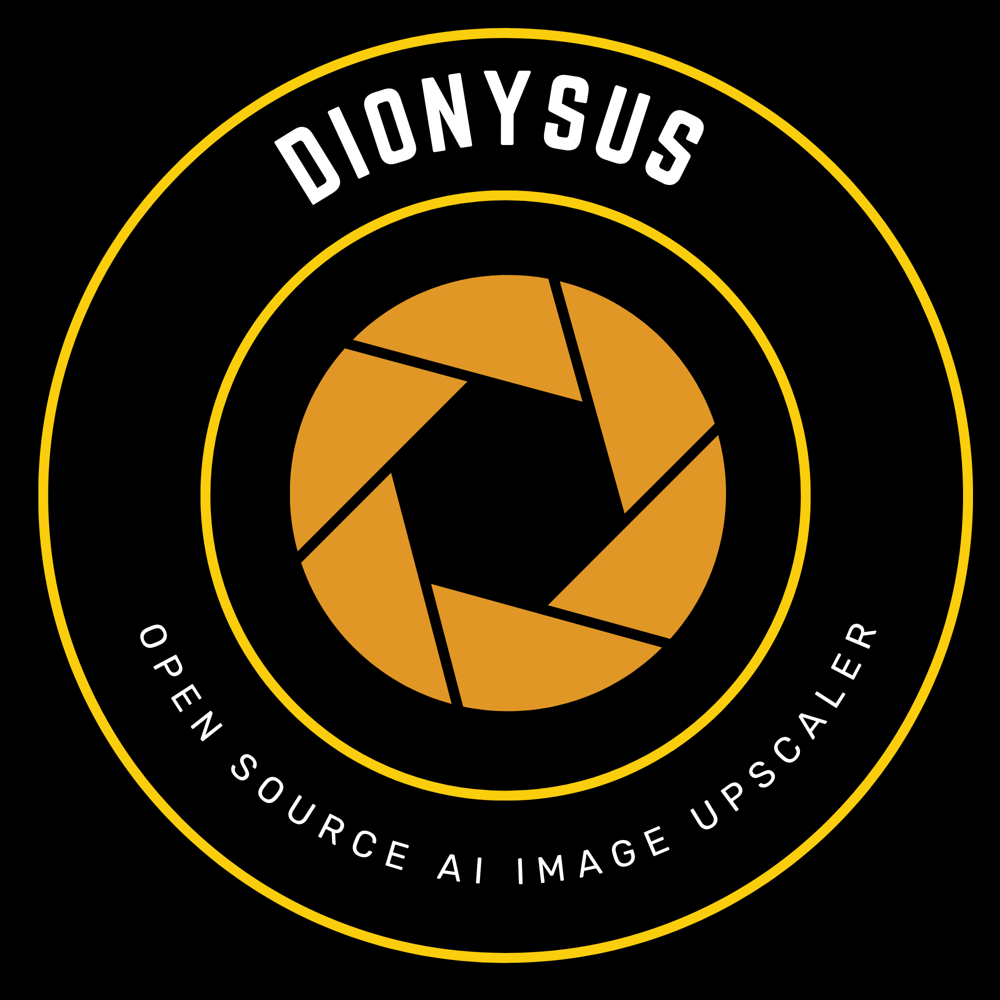
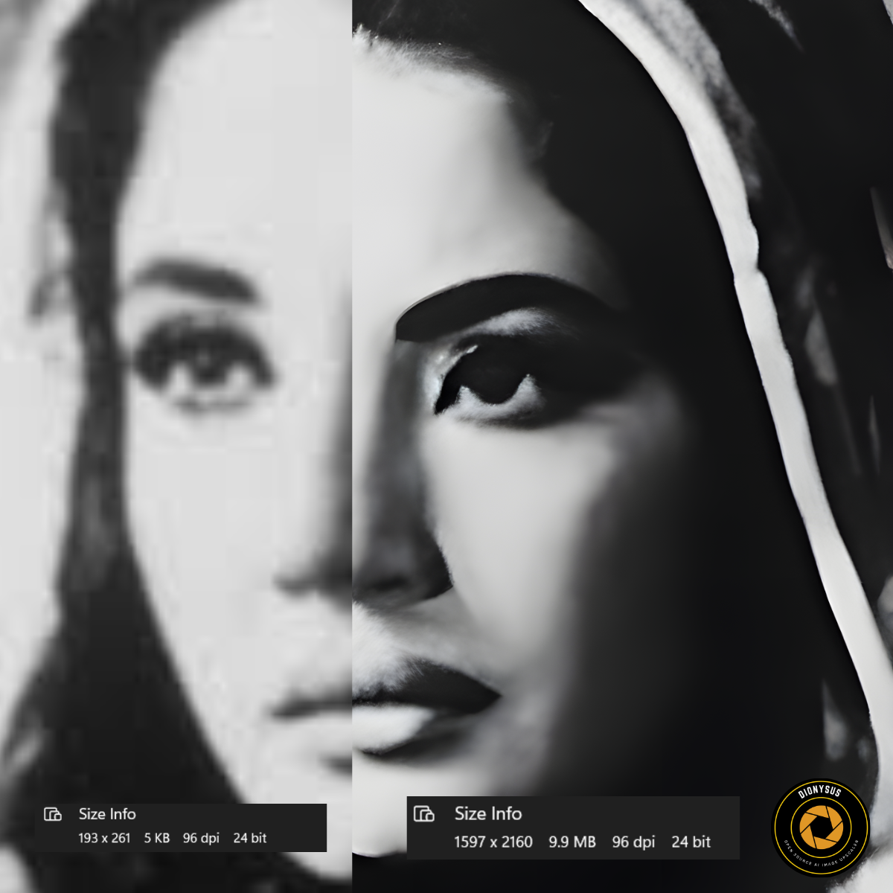
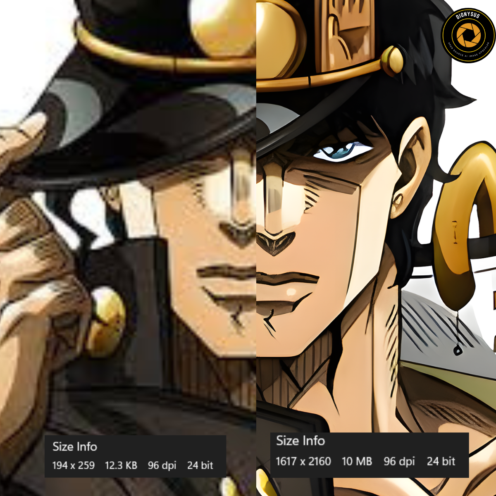
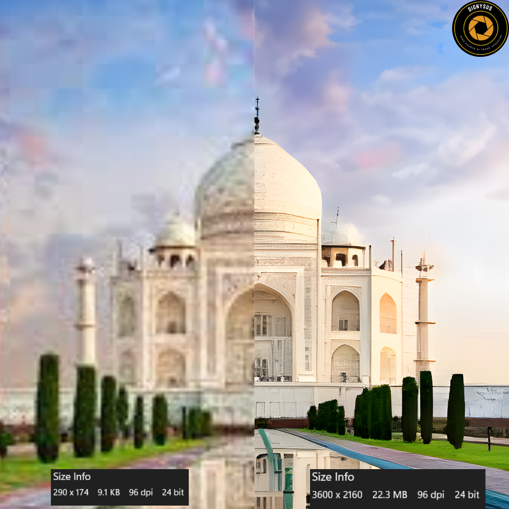
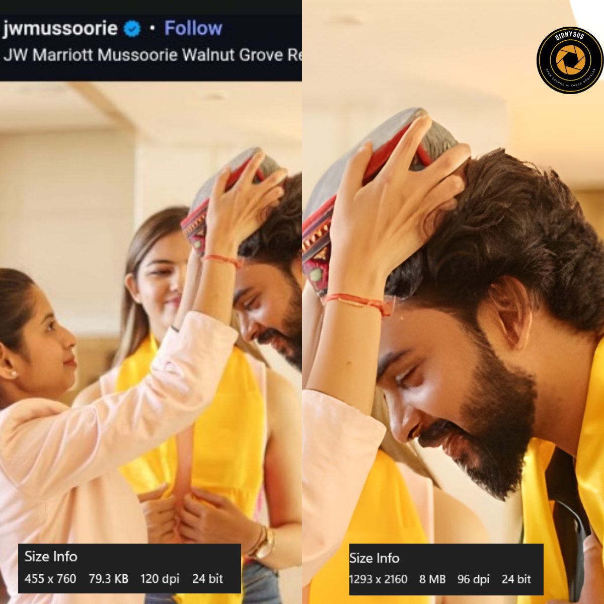
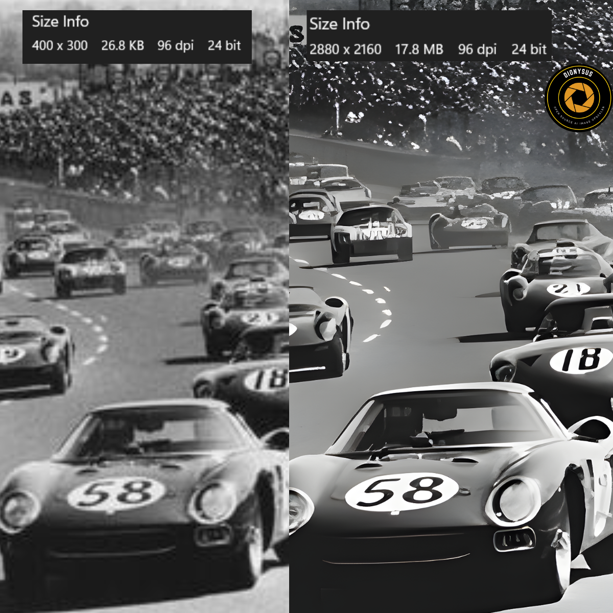

# Dionysus AI Image Upscaler

<p align="center">
  
</p>

<p align="center"><strong>Dionysus AI Image Upscaler</strong> is a Python desktop application for high-quality single-image and bulk-image upscaling with a custom dark GUI, local ONNX model support, and selectable CPU, CUDA, TensorRT, and OpenCL backends.</p>

## Overview

This project focuses on practical local image upscaling rather than cloud processing. It provides a branded desktop interface for loading images, selecting ONNX super-resolution models, choosing an acceleration backend, and exporting cleaner high-resolution outputs for testing, experimentation, and portfolio-quality demos.

## Highlights

- Dionysus-branded dark desktop GUI built with `customtkinter`
- Single-image and bulk-image workflows
- Backend selection for `CPU`, `CUDA`, `TensorRT`, and `OpenCL`
- Output targets for `2x`, `4x`, `Fit to 1080p`, `Fit to 2K`, and `Fit to 4K`
- Production-oriented export controls for `PNG`, `JPG`, and `TIFF`
- Local model dropdown that scans the `models/` folder automatically
- ETA and session feedback in the GUI
- Sample ONNX models included in the repository

## Results

The repository includes example result images in the `Results/` folder.

| Result 1 | Result 2 |
| --- | --- |
|  |  |

| Result 3 | Result 4 |
| --- | --- |
|  |  |

| Result 5 |
| --- |
|  |

## Tech Stack

- Python 3.10+
- `customtkinter`
- `onnxruntime`
- `opencv-python`
- `Pillow`
- `numpy`

## Backend Support

- `CPU`: always available fallback path
- `CUDA`: NVIDIA GPUs through `onnxruntime-gpu`
- `TensorRT`: NVIDIA GPUs when TensorRT runtime libraries are installed and available
- `OpenCL`: AMD, Intel, or other OpenCL-capable GPUs through OpenCV DNN

## Included Models

The repository currently includes sample ONNX models in the local `models/` folder:

- `real-esrgan-x4plus-128.onnx`
- `super-resolution-10.onnx`

You can add additional ONNX models to `models/` and they will appear in the GUI dropdown automatically.

## Installation

```powershell
python -m venv .venv
.venv\Scripts\Activate.ps1
pip install -e .
```

For NVIDIA CUDA execution:

```powershell
pip install -e .[nvidia]
```

## Run

```powershell
ai-upscaler
```

## Model Assumptions

The current pipeline assumes a typical image-to-image super-resolution model with:

- input tensor format `NCHW`
- 3-channel RGB input
- float input scaled to `0..1`
- float output scaled to `0..1`

If your model uses different preprocessing or fixed input sizes, update the preprocessing logic in `src/ai_upscaler/pipeline.py`.

## Repository Structure

- `src/` for application source code
- `models/` for included ONNX upscaling models
- `Results/` for sample output images
- `Dionysus_AI_logo.png` and `Dionysus_AI_logo.ico` for branding assets
- `pyproject.toml` for project metadata and dependencies

## Limitations

- Real output quality still depends heavily on source image quality
- Best results usually come from ESRGAN-style 2x or 4x ONNX models
- `TensorRT` and `CUDA` require compatible local NVIDIA runtime dependencies
- `OpenCL` compatibility depends on the installed GPU driver and OpenCV DNN support

## GitHub Notes

Keep these in the repository:

- `src/`
- `models/`
- `Results/`
- `pyproject.toml`
- `README.md`
- `.gitignore`
- `Dionysus_AI_logo.png`
- `Dionysus_AI_logo.ico`

Do not commit generated folders like `build/`, `dist/`, or temporary local output files unless you intentionally want them versioned.
